<h1>👋 Hi, I'm Tsumbedzo Matloga</h1>

  <strong>Full Stack Developer</strong> · <em>Java & Backend Enthusiast</em>

  &nbsp;
  &nbsp;
  

## Table of Contents

- [About Me](#about-me)
- [Highlights](#highlights)
- [Skills](#skills)
- [Projects](#projects)
- [Certifications](#certifications)
- [Currently Learning](#currently-learning)
- [Most Used Languages](#most-used-languages)
- [Contact](#contact)

---

## About Me

I am a software engineer with expertise in **Java, object-oriented design, and backend development**. I build scalable applications, debug complex systems, and contribute to agile teams — always aiming for clean, efficient, and maintainable code.

- 💼 **Experience:** 1+ years
- 🎓 **Education:** BSc Mathematical Sciences · BSc Hons Computer Science
- 📍 **Location:** Fourways, Gauteng, South Africa
- ✅ **Status:** Open to work

---

## Highlights

- 🏢 **Real-World Experience:** At ITTHYNK Smart Solutions, I contributed to a School Management Dashboard using AWS services like EC2, RDS, S3, and Lambda — ensuring high availability and secure data storage.
- 🗄️ **Database Integration:** Hands-on experience with MySQL and SQL Server, integrating them with Java to build robust backend solutions.
- 🧩 **Object-Oriented Programming:** I apply OOP and design patterns to write reusable, modular, and clean code.
- ⚡ **What excites me about Java:** Powering enterprise-scale solutions with Spring, cloud-ready apps on AWS, and a massive ecosystem for continuous learning.

---

## Skills

### Languages

  
  
  

### Frameworks & Databases

  
  
  
  
  
  

### Tools & Concepts

  
  
  
  
  

**Concepts:** Object-Oriented Programming · Data Structures & Algorithms · Design Patterns · Agile

---

## Projects

<!-- PROJECTS:START -->
| Project | Description | Tech |
|---|---|---|
| [**Todo List App**](https://github.com/Matloga/todo-list-app) | A responsive To-Do List app with CRUD, search, filters, localStorage and dark mode | JavaScript |
| [**Tsumbedzo Portfolio**](https://github.com/Matloga/Tsumbedzo_Portfolio) | A JavaScript project built by Tsumbedzo Matloga. | JavaScript |
| [**Jobapp**](https://github.com/Matloga/jobapp) | A Java project built by Tsumbedzo Matloga. | Java |
| [**Challenge Front End Live**](https://github.com/Matloga/challenge-front-end-live) | React + Vite This template provides a minimal setup to get React working in Vite with HMR and some ESLint rules | JavaScript |
| [**Challengeapp**](https://github.com/Matloga/ChallengeApp) | A Java project built by Tsumbedzo Matloga. | Java |
<!-- PROJECTS:END -->

*Automatically updated daily by a GitHub Action.*

---

## Certifications

  &nbsp;
  &nbsp;
  

---

## Currently Learning

  &nbsp;
  &nbsp;
  

---

## Most Used Languages

  

*Automatically updated daily by a GitHub Action.*

---

## Contact

- 📧 **Email:** [tsumbedzomatloga@gmail.com](mailto:tsumbedzomatloga@gmail.com)
- 🔗 **LinkedIn:** [in/matloga-tsumbedzo](https://www.linkedin.com/in/matloga-tsumbedzo-a44724343)
- 🌐 **Portfolio:** [tsumbedzo-portfolio.vercel.app](https://tsumbedzo-portfolio.vercel.app/)

---

*Building scalable systems, one line of code at a time.*

